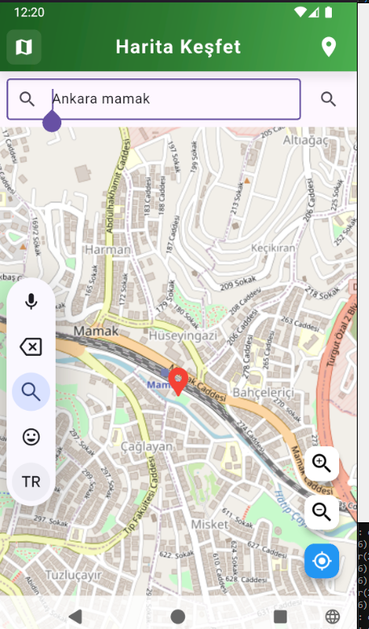
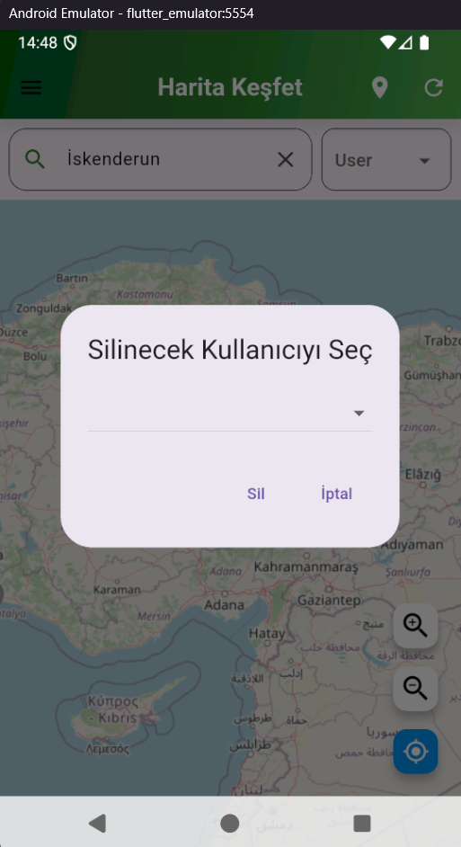
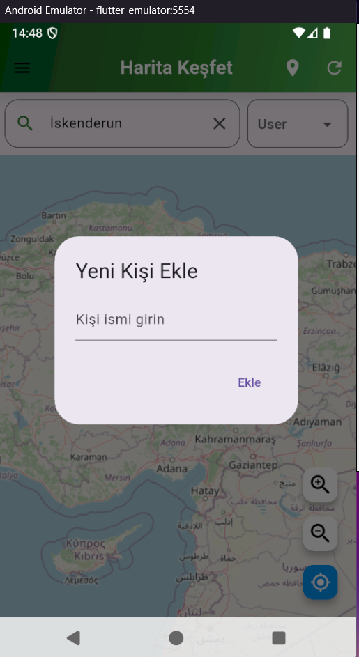
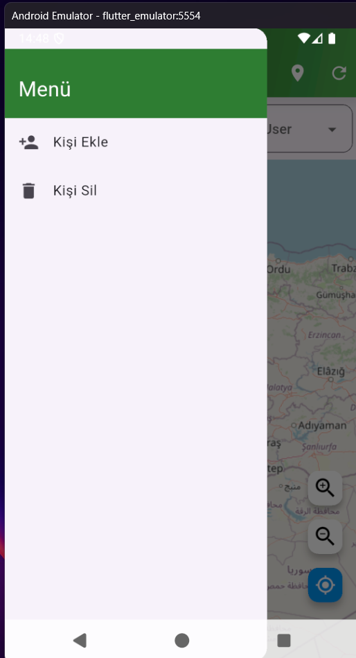
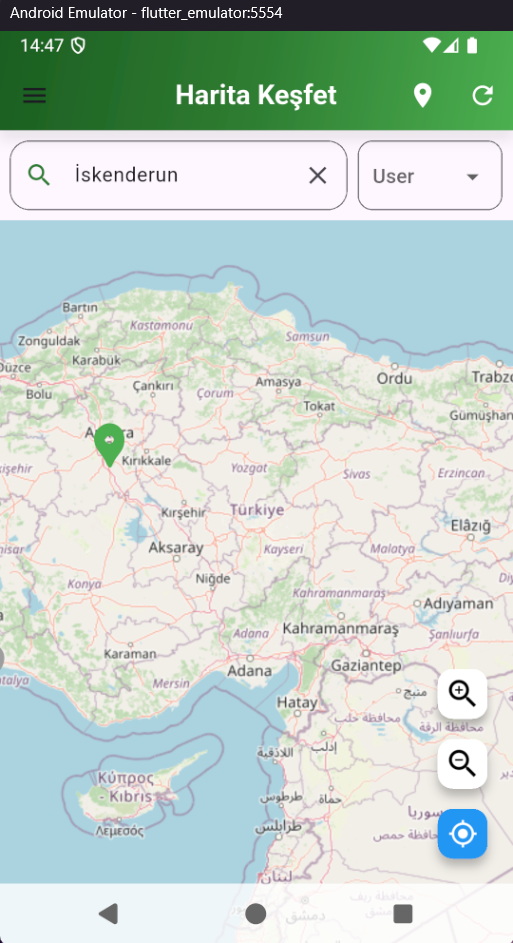
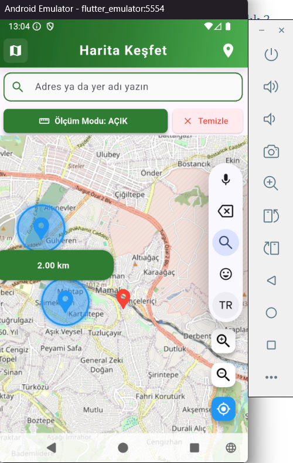

# Mobil GIS Uygulaması

Bu proje, **Flutter** ile geliştirilmiş bir mobil **Coğrafi Bilgi Sistemi (GIS)** uygulamasıdır. Harita tabanlı bu sistem, kullanıcılar ve onların favori mekânlarının yönetilebildiği interaktif bir arayüz sunar. Proje; Flutter (Dart), Python (Flask), PostgreSQL ve OpenStreetMap teknolojilerini entegre şekilde kullanır.

---

##  Teknolojiler

- **Frontend (Mobil):**
  - [Flutter](https://flutter.dev/) (Dart)
  - [OpenStreetMap](https://www.openstreetmap.org/) (Flutter için açık kaynaklı harita kütüphanesi)
  - Harita işlevleri için `flutter_map` paketi (Leaflet tabanlı)
  - Gerçek zamanlı kullanıcı etkileşimi, GPS ve marker yönetimi
  - Responsive, sade ve kullanışlı kullanıcı arayüzü

- **Backend:**
  - [Flask](https://flask.palletsprojects.com/) (Python ile REST API)
  - PostgreSQL veritabanı
  - RESTful servislerle veri alışverişi

- **Veritabanı:**
  - PostgreSQL (users ve positions tabloları)
  - Kullanıcı bilgileri ve favori mekânların konum bilgileri tutulur

---

##  Özellikler

###  Harita Özellikleri
- OpenStreetMap üzerinden harita entegrasyonu
- Marker (işaretleyici) ekleme ve silme
- GPS desteği ile konum belirleme
- Harita üzerinde büyütme/küçültme
- Kullanıcı seçildiğinde, o kullanıcıya ait favori mekanlar haritada otomatik olarak gösterilir

###  Kullanıcı Yönetimi
- Yeni kullanıcı ekleme
- Kullanıcı silme
- Kullanıcıya özel mekan bilgisi tanımlama
- Yan panel üzerinden kullanıcıları listeleme ve yönetme

###  Arama Motoru
- Harita arayüzüne entegre edilmiş arama çubuğu
- Kişi adına veya mekân adına göre arama yapılabilir

---

## 🗺 Harita Kütüphaneleri Hakkında

- **Flutter:** `flutter_map` ile OpenStreetMap kullanıldı. Açık kaynak ve özelleştirilebilir yapıdadır.
- **Kotlin ile çalışılacaksa:** [WorldWind](https://github.com/NASAWorldWind/WorldWindAndroid) gibi açık kaynaklı kütüphaneler kullanılabilir (NASA desteklidir).

---

##  Uygulama Ekran Görüntüleri

  
  
  
  
  
  

